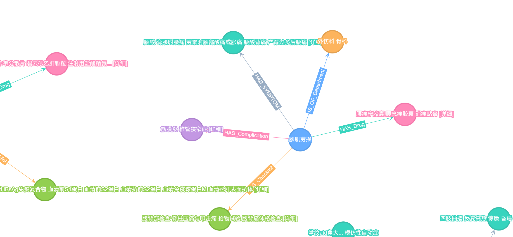
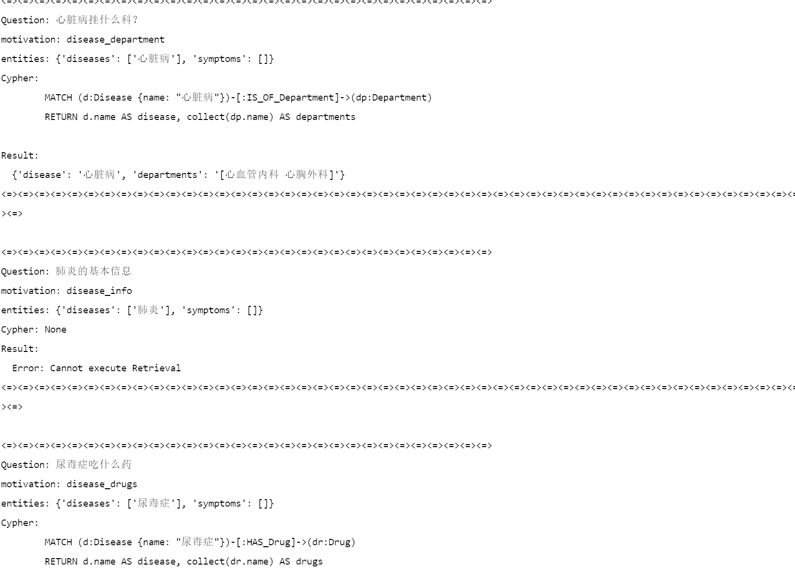

# Hw02
本次作业为在TuGraph上测试医疗对话助手  
## 数据处理  
首先我们还是要服从图数据库的基本流程，构建关系词和实体，仍然是从节点到边，最后到图的完整的流程
```python
import pandas as pd
import json
import os

COLS = ['name', 'alias', 'part', 'age', 'infection', 'insurance', 'department', 'checklist', 'symptom', 'complication', 'treatment', 'drug', 'period', 'rate', 'money']

NODES = {
    'symptom': 'Symptom',
    'department': 'Department', 
    'drug': 'Drug',
    'complication': 'Complication',
    'checklist': 'CheckItem'
}

EDGE_MAPPING = {
    'symptom': 'HAS_SYMPTOM',
    'department': 'IS_OF_Department',
    'drug': 'HAS_Drug',
    'complication': 'HAS_Complication',
    'checklist': 'HAS_Checklist'
}

def load_and_split(csv_path='data.csv'):
    df = pd.read_csv(csv_path)
    print(df.columns.tolist())
    df = df[COLS] 

    disease_df = df[['name', 'alias', 'part', 'age', 'infection', 'insurance', 'treatment', 'period', 'rate', 'money']].copy()
    
    entities = {'Disease': disease_df}

    for col, label in NODES.items(): 
        unique_values = set()
        for val in df[col].dropna(): 
            for v in str(val).split(','):
                v = v.strip()
                if v : 
                    unique_values.add(v) 
        entities[label] = pd.DataFrame({"name": sorted(unique_values)})

    edges = []
    for col, edge_label in EDGE_MAPPING.items():
        for _, row in df.iterrows():
            disease_name = row['name']
            if pd.notna(row[col]):
                values = str(row[col]).split(',')
                for val in values:
                    val = val.strip()
                    if val:
                        edges.append({
                            "src": disease_name,
                            "dst": val,
                            "label": edge_label
                        })

    return entities, pd.DataFrame(edges)

def generate_schema():
    return {
        "schema": [
            {
                "label": "Disease",
                "type": "VERTEX",
                "properties": [
                    {"name": "name", "type": "STRING", "optional": False, "index": True},
                    {"name": "alias", "type": "STRING", "optional": True},
                    {"name": "part", "type": "STRING", "optional": True},
                    {"name": "age", "type": "STRING", "optional": True},
                    {"name": "infection", "type": "STRING", "optional": True},
                    {"name": "insurance", "type": "STRING", "optional": True},
                    {"name": "treatment", "type": "STRING", "optional": True},
                    {"name": "period", "type": "STRING", "optional": True},
                    {"name": "rate", "type": "STRING", "optional": True},
                    {"name": "money", "type": "STRING", "optional": True}
                ],
                "primary": "name"
            },
            {
                "label": "Symptom",
                "type": "VERTEX",
                "properties": [
                    {"name": "name", "type": "STRING", "optional": False, "unique": True, "index": True}
                ],
                "primary": "name"
            },
            {
                "label": "Department",
                "type": "VERTEX",
                "properties": [
                    {"name": "name", "type": "STRING", "optional": False, "unique": True, "index": True}
                ],
                "primary": "name"
            },
            {
                "label": "Drug",
                "type": "VERTEX",
                "properties": [
                    {"name": "name", "type": "STRING", "optional": False, "unique": True, "index": True}
                ],
                "primary": "name"
            },
            {
                "label": "Complication",
                "type": "VERTEX",
                "properties": [
                    {"name": "name", "type": "STRING", "optional": False, "unique": True, "index": True}
                ],
                "primary": "name"
            },
            {
                "label": "CheckItem",
                "type": "VERTEX",
                "properties": [
                    {"name": "name", "type": "STRING", "optional": False, "unique": True, "index": True}
                ],
                "primary": "name"
            },
            {
                "label": "HAS_SYMPTOM",
                "type": "EDGE",
                "properties": [],
                "constraints": [["Disease", "Symptom"]]
            },
            {
                "label": "IS_OF_Department",
                "type": "EDGE",
                "properties": [],
                "constraints": [["Disease", "Department"]]
            },
            {
                "label": "HAS_Drug",
                "type": "EDGE",
                "properties": [],
                "constraints": [["Disease", "Drug"]]
            },
            {
                "label": "HAS_Complication",
                "type": "EDGE",
                "properties": [],
                "constraints": [["Disease", "Complication"]]
            },
            {
                "label": "HAS_Checklist",
                "type": "EDGE",
                "properties": [],
                "constraints": [["Disease", "CheckItem"]]
            }
        ]
    }

def main():
    entities, edges_df = load_and_split()
    
    os.makedirs("Nodes_Edges", exist_ok=True)
    os.makedirs("Graph", exist_ok=True)
    
    for node_label, df_node in entities.items():
        df_node.to_csv(f"Nodes_Edges/{node_label}.csv", index = False)
        print(f"Saved Node:{node_label} ({len(df_node)} of record)")
    
    for edge_label in EDGE_MAPPING.values():
        edge_subset = edges_df[edges_df['label'] == edge_label][['src', 'dst']]
        if not edge_subset.empty:
            target_label = [k for k, v in EDGE_MAPPING.items() if v == edge_label][0]
            target_node = NODES[target_label]

            edge_subset.columns = ["Disease:name", f"{target_node}:name"]
            edge_subset.to_csv(f"Nodes_Edges/{edge_label}.csv", index = False)
            print(f"Saved Edge: {edge_label} ({len(edge_subset)} of record")
        
    with open("Graph/schema.json", "w", encoding="utf-8") as f:
        json.dump(generate_schema(), f, indent=4, ensure_ascii=False)

if __name__ == "__main__":
    main()
```
上面的代码即用于构建csv数据中读取实体，以及实体之间的联系，实体的属性，之后把他们到处成为独立的数据，构成节点和边  
那么既然导入成功，之后我们就需要把他上传到对应的TuGraph的数据库上  
## 导入TuGraph数据库

```python
import os
import json
import subprocess

def get_tugraph_container():
    result = subprocess.run(
        ["docker", "ps", "--filter", "ancestor=tugraph/tugraph-runtime-centos7:3.4.0", "--format", "{{.Names}}"],
        capture_output=True,
        text=True
    )
    containers = result.stdout.strip().split('\n')
    if containers and containers[0]:
        return containers[0]
    else:
        print("Error: Cannot find TuGraph container")
        print("Set TuGraph container up first, or point the container name")
        return None

def generate_import_config():

    with open("./Graph/schema.json", "r", encoding="utf-8") as f:
        schema_data = json.load(f)

    config = {
        "schema": schema_data["schema"],

        "files": [
            {"path": "/data/Nodes_Edges/Disease.csv", "format": "CSV", "label": "Disease", "header": 1,
             "columns": ["name", "alias", "part", "age", "infection", "insurance", "treatment", "period", "rate", "money"]},
            {"path": "/data/Nodes_Edges/Symptom.csv", "format": "CSV", "label": "Symptom", "header": 1, "columns": ["name"]},
            {"path": "/data/Nodes_Edges/Department.csv", "format": "CSV", "label": "Department", "header": 1, "columns": ["name"]},
            {"path": "/data/Nodes_Edges/Drug.csv", "format": "CSV", "label": "Drug", "header": 1, "columns": ["name"]},
            {"path": "/data/Nodes_Edges/Complication.csv", "format": "CSV", "label": "Complication", "header": 1, "columns": ["name"]},
            {"path": "/data/Nodes_Edges/CheckItem.csv", "format": "CSV", "label": "CheckItem", "header": 1, "columns": ["name"]},
            
            {"path": "/data/Nodes_Edges/HAS_SYMPTOM.csv", "format": "CSV", "label": "HAS_SYMPTOM", "header": 1,
             "SRC_ID": "Disease", "DST_ID": "Symptom", "columns": ["SRC_ID", "DST_ID"]},
            {"path": "/data/Nodes_Edges/IS_OF_Department.csv", "format": "CSV", "label": "IS_OF_Department", "header": 1,
             "SRC_ID": "Disease", "DST_ID": "Department", "columns": ["SRC_ID", "DST_ID"]},
            {"path": "/data/Nodes_Edges/HAS_Drug.csv", "format": "CSV", "label": "HAS_Drug", "header": 1,
             "SRC_ID": "Disease", "DST_ID": "Drug", "columns": ["SRC_ID", "DST_ID"]},
            {"path": "/data/Nodes_Edges/HAS_Complication.csv", "format": "CSV", "label": "HAS_Complication", "header": 1,
             "SRC_ID": "Disease", "DST_ID": "Complication", "columns": ["SRC_ID", "DST_ID"]},
            {"path": "/data/Nodes_Edges/HAS_Checklist.csv", "format": "CSV", "label": "HAS_Checklist", "header": 1,
             "SRC_ID": "Disease", "DST_ID": "CheckItem", "columns": ["SRC_ID", "DST_ID"]}
        ]
    }
    
    os.makedirs("Graph", exist_ok=True)
    with open("Graph/import.conf", "w", encoding="utf-8") as f:
        json.dump(config, f, indent=2, ensure_ascii=False)
    print("Configuration finished")

def import_data(container_name=None, graph_name="medical_graph"):
    
    if container_name is None:
        container_name = get_tugraph_container()
        if container_name is None:
            return
    
    print(f"Using Container: {container_name}")
    
    generate_import_config()
    
    try:
        subprocess.run(["docker", "cp", "./Nodes_Edges", f"{container_name}:/data/"], check=True)
        subprocess.run(["docker", "cp", "./Graph/import.conf", f"{container_name}:/data/"], check=True)
        print("Successfully copy data")
    except subprocess.CalledProcessError as e:
        print(f"Copy Failure: {e}")
        return
    
    import_cmd = [
        "docker", "exec", container_name,
        "lgraph_import",
        "-c", "/data/import.conf",
        "-d", "/var/lib/lgraph/data",
        "--graph", graph_name,
        "-i", "true",
        "--overwrite", "true",
        "--verbose", "2", 
        "--user", "admin",
        "--password", "Szh168kk"
    ]
    
    result = subprocess.run(import_cmd, capture_output=True, text=True)
    
    print(result.stdout)
    
    if result.returncode == 0:
        print("\nSuccessfully import data")
    else:
        print("\nImport Failure")
        print(result.stderr)

if __name__ == "__main__": 
    import_data(container_name="XXXX", graph_name="XXXX")
```
之后我们找到对应的端口映射即可，需要等待数据上传一段时间，那么我们可以查下关系图，用Cypher语句在TuGraph的图形化界面

```Cypher
MATCH (n)-[r]->(m)
RETURN n, r, m
LIMIT 40
```


## 建立问答系统
构建CYPHER语句解析器，然后获取bolt协议的响应，使得对话系统可以访问TuGraph数据库

```python
from neo4j import GraphDatabase
import re
import logging

MOTIVATIONS_CONFIG = {
    'symptom_to_disease': {'keywords': {'症状', '病情', '表现', '特征', '可能是什么病', '什么病', '为什么', '原因', '怎么', '怎么造成'}},
    'disease_symptoms': {'keywords': {'症状', '情况', '特征', '有哪些症状', '症状有哪些', '什么症状'}},
    'disease_drugs': {'keywords': {'服用', '服药', '药', '用药', '吃什么药', '用什么药', '药物', '啥药'}},
    'disease_department': {'keywords': {'科室', '挂什么科', '看什么科', '什么科', '什么科室', '部门', '什么部门'}},
    'disease_treatment': {'keywords': {'治疗', '怎么治', '如何治', '治疗方法', '治疗方案', '怎么办'}},
    'disease_complications': {'keywords': {'并发症', '并发疾病'}},
    'disease_info': {'keywords': {'信息', '详情', '介绍', '是什么', '什么是', '有什么', '有哪些'}},
}

CYPHER_BOARDS = {
    'symptom_to_disease': """
        MATCH (s:Symptom)-[:HAS_SYMPTOM]-(d:Disease)
        WHERE s.name IN [{symptoms}]
        RETURN d.name AS disease, collect(s.name) AS matched_symptoms LIMIT 10
    """,
    'disease_symptoms': """
        MATCH (d:Disease {{name: "{disease}"}})-[:HAS_SYMPTOM]->(s:Symptom)
        RETURN d.name AS disease, collect(s.name) AS symptoms
    """,
    'disease_drugs':"""
        MATCH (d:Disease {{name: "{disease}"}})-[:HAS_Drug]->(dr:Drug)
        RETURN d.name AS disease, collect(dr.name) AS drugs
    """,
    'disease_department':"""
        MATCH (d:Disease {{name: "{disease}"}})-[:IS_OF_Department]->(dp:Department)
        RETURN d.name AS disease, collect(dp.name) AS departments
    """,
    'disease_treatment':"""
        MATCH (d:Disease {name: "{disease}"})
        RETURN d.name AS disease, d.treatment AS treatment, d.period AS period
    """
}

class EntityLoader:
    def __init__(self, driver, dbs):
        self.driver = driver
        self.dbs = dbs 
        self.diseases = [] 
        self.symptoms = [] 
        self.load()

    def _load(self, label): 
        cypher = f"MATCH (n:{label}) RETURN n.name AS name" 
        with self.driver.session(database=self.dbs) as session: 
            result = session.run(cypher)
            return [r["name"].lower() for r in result if r["name"]]

    def load(self):
        self.diseases = self._load("Disease")
        self.symptoms = self._load("Symptom")

class MotivationDetector: 
    @staticmethod
    def detect(text: str) -> str:
        text = text.lower()
        best, max_score = 'disease_info', 0
        for motivation, data in MOTIVATIONS_CONFIG.items():
            score = sum(k in text for k in data['keywords'])
            if score > max_score:
                max_score, best = score, motivation
        return best

class EntityExtractor: 
    def __init__(self, entities): 
        self.entities = entities

    def extract(self, text): 
        text = text.lower()
        diseases = [d for d in self.entities.diseases if d in text]
        symptoms = [s for s in self.entities.symptoms if s in text]
        if not diseases and not symptoms:
            stopwords = {'怎么', '什么', '哪些', '为什么', '吗', '呢', '了', '的', '是'}
            words = [w for w in text.split() if len(w) > 1 and w not in stopwords]
            symptoms = words if words else [text]
        return {'diseases': diseases, 'symptoms': symptoms}

class CypherCreator:
    @staticmethod
    def escape(value):
        return value.replace("'", "\\'")
    @staticmethod
    def generate(motivation, entities):
        if motivation == 'symptom_to_disease':
            symptoms = entities.get('symptoms', [])
            if not symptoms:
                return None
            symptom_str = ', '.join(f'"{s}"' for s in symptoms)
            return CYPHER_BOARDS['symptom_to_disease'].format(symptoms=symptom_str)

        if not entities['diseases']:
            return None

        disease = CypherCreator.escape(entities['diseases'][0])
        template = CYPHER_BOARDS.get(motivation)
        if not template:
            return None

        return template.format(disease=disease)

class QueryExecutor:
    def __init__(self, driver, dbs):
        self.driver = driver
        self.dbs = dbs

    def execute(self, cypher: str):
        if not cypher:
            return [{"error": "Cannot execute Retrieval"}]
        try:
            with self.driver.session(database=self.dbs) as session:
                result = session.run(cypher)
                return [dict(r) for r in result]
        except Exception as e:
            return [{"error": str(e)}]


class QueryParserAnalyser:
    def __init__(self, uri, usr, passwd, dbs): 
        self.driver = GraphDatabase.driver(uri, auth = (usr, passwd))
        self.dbs = dbs
        self.entities = EntityLoader(self.driver, dbs)
        self.motivation_detect = MotivationDetector()
        self.entity_extractor = EntityExtractor(self.entities)
        self.cypher_gen = CypherCreator()
        self.executor = QueryExecutor(self.driver, dbs)

    def parser_query(self, user_input):
        text = re.sub(r'[^\w\s]', '', user_input.lower()).strip()
        motivation = self.motivation_detect.detect(text)
        entities = self.entity_extractor.extract(text)
        cypher = self.cypher_gen.generate(motivation, entities)
        result = self.executor.execute(cypher)
        return {
            'original_input': user_input,
            'motivation': motivation,
            'entities': entities,
            'cypher': cypher,
            'result': result
        }

    def format_result(self, result):

        output = []
        output.append(f"Question: {result['original_input']}")
        output.append(f"motivation: {result['motivation']}")
        output.append(f"entities: {result['entities']}")
        output.append(f"Cypher: {result['cypher']}")
        output.append("Result:")

        for item in result['result']:
            if isinstance(item, dict) and 'error' in item:
                output.append(f"  Error: {item['error']}")
            else:
                output.append("  " + str(item))

        return "\n".join(output)
    
if __name__ == "__main__":
    URI = "bolt://localhost:7690"
    usr = "admin"
    passwd = "Szh168kk"
    dbs = "MedicalGraph"

    parser = QueryParserAnalyser(uri = URI, usr = usr, passwd = passwd, dbs = dbs)

    test_queries = [
        "头痛，可能是什么原因？",
        "癫痫的症状有哪些？",
        "糖尿病吃什么药？",
        "心脏病挂什么科？",
        "肺炎的基本信息", 
        "尿毒症吃什么药",
        "肾虚怎么治疗"
        
    ]

    try:
        for query in test_queries:
            print("<=>" * 30)
            result = parser.parser_query(query)
            formatted_output = parser.format_result(result)
            print(formatted_output)
            print("<=>" * 50)
            print()
    except Exception as e:
        import traceback
        print(f"错误: {e}")
        traceback.print_exc()
        print(f"错误: {e}")
    print("-" * 50)
```
运行结果可见截图: 




